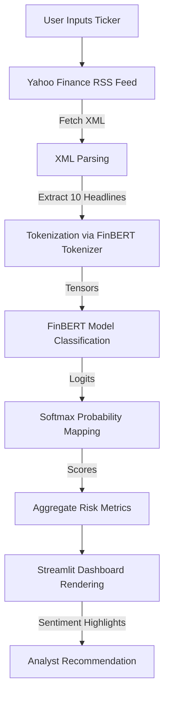

# 📈 AI-Powered Financial News Sentiment & Risk Analyzer

[](https://www.python.org/)
[](https://streamlit.io/)
[](https://huggingface.co/transformers/)
[](https://pytorch.org/)

An AI-driven dashboard tailored for risk analysts to scan real-time financial news, analyze sentiment trends, and automatically flag potential market and credit risks. Powered by **FinBERT** (Financial Bidirectional Encoder Representations from Transformers), this application processes live news feeds directly from Yahoo Finance to deliver instant, actionable sentiment metrics.

---

## 📖 Table of Contents
- [Project Overview](#-project-overview)
- [Key Features](#-key-features)
- [Architecture & Workflow](#-architecture--workflow)
- [Tech Stack](#-tech-stack)
- [Installation & Setup](#-installation--setup)
- [Usage Guide](#-usage-guide)
- [Project Structure](#-project-structure)
- [Future Innovations](#-future-innovations)
- [License](#-license)

---

## 🔍 Project Overview

In fast-paced financial markets, risk assessment demands real-time intelligence. This tool enables risk professionals to monitor sentiment volatility for any publicly traded security. By analyzing recent news headlines using a specialized NLP model, the analyzer generates:
- An overall risk status category (**STABLE** vs. **HIGH RISK**).
- Probability metrics for Positive, Negative, and Neutral sentiment.
- Immediate action recommendations based on aggregated sentiment scores.

---

## 🌟 Key Features

- **No-Key RSS Scraping**: Automatically fetches the 10 most recent financial headlines for any given ticker via Yahoo Finance RSS, bypassing the need for complex API integrations or developer subscriptions.
- **FinBERT NLP Engine**: Utilizes `ProsusAI/finbert`, a BERT model specifically pre-trained on financial communication, ensuring high accuracy on domain-specific vocabulary (e.g., distinguishing between market "inflation" vs "growth").
- **Dynamic Risk Categorization**: Calculates a running average of negative sentiment. If average negative sentiment exceeds 40%, the system flags a `HIGH RISK 🚨` warning.
- **Interactive Web Interface**: Built with Streamlit, providing a sleek, responsive dashboard complete with visual metric cards and interactive, color-coded data tables.
- **Actionable Recommendations**: Automatically advises risk analysts on next steps (e.g., escalating credit portfolio risk reviews if negativity exceeds the threshold).

---

## ⚙️ Architecture & Workflow



1. **Extraction**: The system targets the Yahoo Finance RSS feed for a requested ticker (e.g., `DB` for Deutsche Bank) and extracts the headlines and timestamps.
2. **NLP Inference**: Tensors are generated by the Hugging Face tokenizer and evaluated by FinBERT.
3. **Post-Processing**: Logits are converted into probability percentages. A dominant class label (Positive, Negative, or Neutral) is assigned using a PyTorch argmax function.
4. **Visualization**: Streamlit renders metrics and formats the report with conditional CSS styling.

---

## 🛠️ Tech Stack

| Technology | Library | Version | Description |
| :--- | :--- | :--- |
| **Python** | 3.8+ | Core application logic |
| **Streamlit** | 1.35.0 | User interface & reactive rendering |
| **Hugging Face Transformers** | 4.41.2 | Deep learning model pipeline loading |
| **PyTorch** | 2.3.1 | Tensor operations and neural network inference |
| **Pandas** | 2.2.2 | Data structuring, metric aggregation, and styling |
| **NLTK** | 3.8.1 | Text parsing helper libraries |
| **Urllib3** | 2.2.1 | Secure HTTP requests to Yahoo Finance RSS |

---

## 🚀 Installation & Setup

Follow these steps to run the financial sentiment analyzer locally:

### Prerequisites
- Python 3.8 to 3.11 installed.
- Internet connection (required for fetching live RSS news and downloading the FinBERT model on the first run).

### Steps

1. **Clone the Repository**
   ```bash
   git clone https://github.com/your-username/financial-sentiment-analyzer.git
   cd financial-sentiment-analyzer
   ```

2. **Create a Virtual Environment** (Recommended)
   ```bash
   # Windows
   python -m venv venv
   .\venv\Scripts\activate

   # macOS / Linux
   python3 -m venv venv
   source venv/bin/activate
   ```

3. **Install Dependencies**
   ```bash
   pip install -r requirements.txt
   ```
   > ⚠️ **Note**: Installing `torch` (PyTorch) and `transformers` may take a few minutes depending on your internet connection.

4. **Launch the Application**
   ```bash
   streamlit run app.py
   ```

5. **Access the Dashboard**
   Open your browser and navigate to:
   ```text
   http://localhost:8501
   ```

---

## 📈 Usage Guide

1. **Configure Ticker**: In the left sidebar, enter the ticker symbol you wish to analyze (e.g., `DB` for Deutsche Bank, `AAPL` for Apple, `TSLA` for Tesla).
2. **Execute**: Click the **"Run Risk Assessment"** button.
3. **Analyze Results**:
   - **Risk Status Card**: Shows `HIGH RISK 🚨` or `STABLE ✅` depending on average negativity.
   - **Average Sentiment Details**: Displays the overall balance of positive sentiment across all 10 articles.
   - **Interactive Table**: A breakdown of each news headline, publishing date, link, and percentage likelihood for each sentiment category. Negative news is highlighted in light red, while positive news is highlighted in light green.
   - **Analyst Recommendations**: Offers guidance based on the risk profile.

---

## 📁 Project Structure

```text
financial-sentiment-analyzer/
├── __pycache__/            # Python bytecode cache
├── analyzer.py             # Logic for fetching RSS feed and running FinBERT inference
├── app.py                  # Streamlit frontend layout and interactive tables
├── requirements.txt        # Project dependencies and version pins
└── README.md               # Documentation (this file)
```

- **[analyzer.py](file:///c:/College_Stuff/financial-sentiment-analyzer/analyzer.py)**: Handles network requests to Yahoo Finance RSS and utilizes PyTorch + Hugging Face's pipeline to produce sentiment scores.
- **[app.py](file:///c:/College_Stuff/financial-sentiment-analyzer/app.py)**: Configures the layout, manages state, computes aggregate sentiment variables, and styles the user dashboard.

---

## 🔮 Future Innovations & Roadmap

To evolve this tool into an enterprise-grade risk management platform, the following features are proposed:

- [ ] **Multi-Source Scraping**: Expand scraping capabilities to ingest news from Bloomberg, Reuters, Wall Street Journal, and social sentiment indicators (e.g., Stocktwits, Reddit).
- [ ] **Historical Trend Analytics**: Save analysis reports to a database to plot historical sentiment changes over weeks or months.
- [ ] **Time-Weighted Risk Modeling**: Weight newer headlines more heavily in the risk score than older ones.
- [ ] **Automated Alerts**: Integrate Slack/Teams webhooks or SendGrid email APIs to alert key stakeholders automatically when any target ticker enters the `HIGH RISK` zone.
- [ ] **Portfolio Batch Processing**: Enable CSV file uploads of custom stock portfolios to analyze multiple assets simultaneously on a single grid dashboard.
- [ ] **Proprietary Model Fine-Tuning**: Fine-tune FinBERT on bank-internal risk reports to better match organizational definitions of credit and market hazards.

---

## 📄 License

This project is licensed under the MIT License. 
